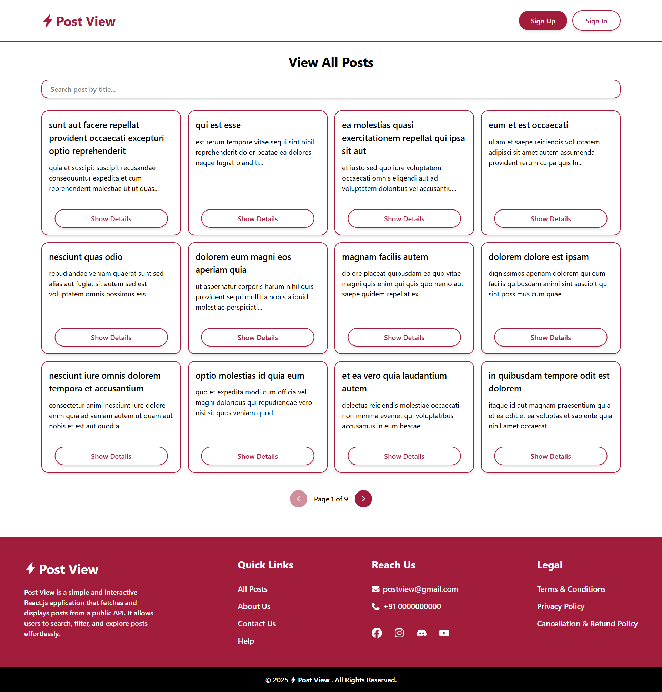
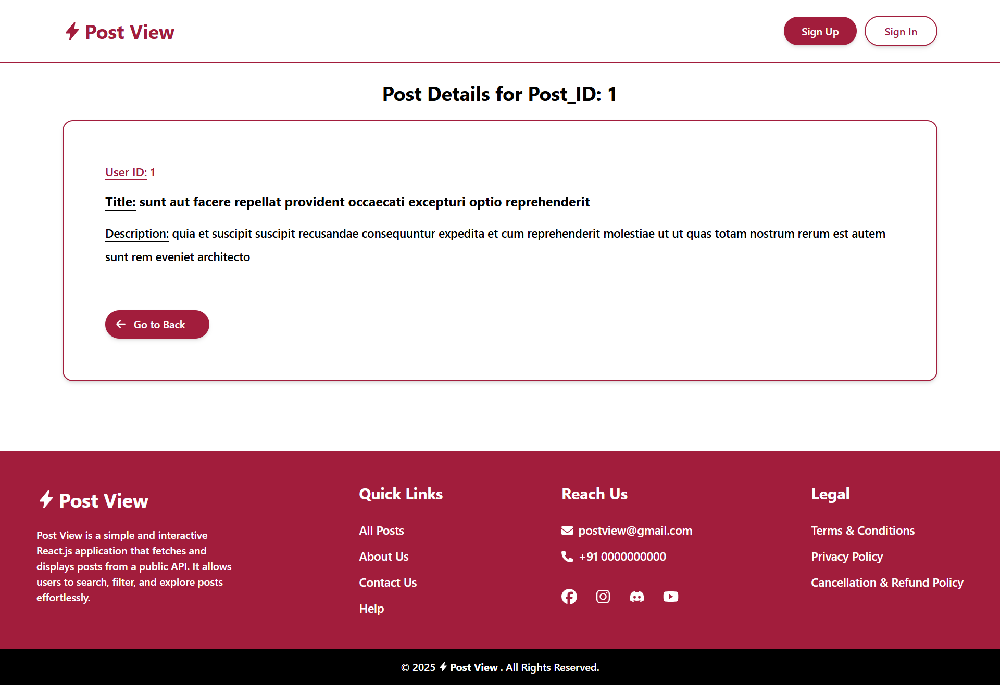

# Project Name: Post View Website

Website Link: https://post-view-frontend.vercel.app/posts

Technologies: JavaScript, Tailwind CSS, ReactJS, Redux Toolkit, React Router.
Description: Post View is a simple and interactive React.js application that fetches and displays posts from a public API. It allows users to search, filter, and explore posts effortlessly. Built with React, Redux Toolkit, React Router, and Tailwind CSS, it provides a seamless and responsive user experience.

# Website View:

Landing Page View:

Posts Page View:

Post Details Page View:

# Run

# Clone this repository
$ git clone https://github.com/ShailySarker/Post-View-Frontend  

# Go into the repository
$ cd Flashcard-Learning-App-Frontend

# Install dependencies
$ npm install

# Run the app
$ npm run dev
